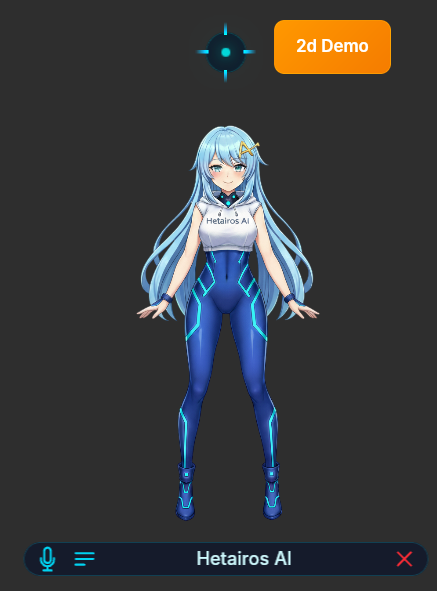
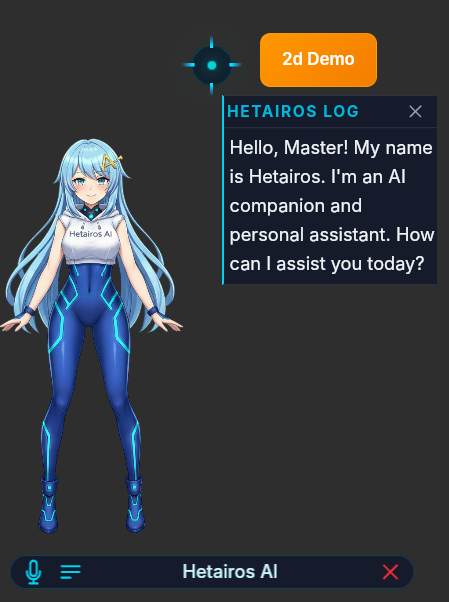
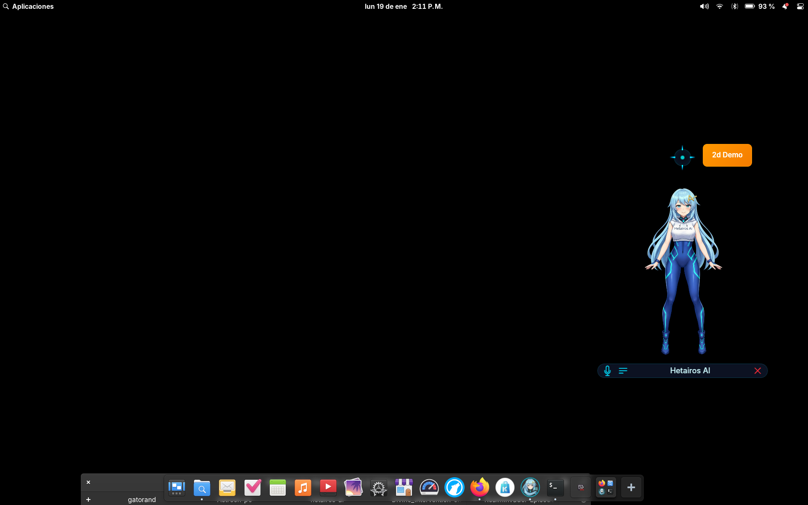

# Hetairos AI - Public Repository

<div align="center">



**Your AI Waifu Assistant with Voice and Animated Interactions**

[](https://github.com/N3koSempai/hetairos-open/issues)
[](https://github.com/N3koSempai/hetairos-open/blob/main/LICENSE)
[](https://flathub.org)

</div>

## About This Repository

This is the **public-facing repository** for Hetairos AI, serving as the central hub for:

- 🐛 **Issue Tracking** - Report bugs, request features, and track development progress
- 📸 **Screenshots & Assets** - Public media assets for distribution platforms (Flathub, etc.)
- 📋 **Public Documentation** - User guides, FAQs, and community resources
- 💬 **Community Discussion** - Engage with other users and the development team

> **Note:** The main source code repository is private. This repository exists to provide transparency and community engagement for a proprietary application.

## What is Hetairos AI?

Hetairos AI is a unique desktop AI assistant that combines powerful local AI models with charming animated character interactions. Unlike typical AI assistants, Hetairos brings your desktop to life with an animated companion that responds to your voice and provides intelligent assistance.

### Key Features

- 🎭 **Interactive Waifu Character** - Expressive animations and personality-driven interactions
- 🎤 **Real-time Voice Interaction** - Natural speech-to-text and text-to-speech capabilities
- 🔒 **Complete Privacy** - All AI model execution happens locally—no cloud services required
- 🧠 **Powerful Local LLM** - Intelligent responses using state-of-the-art language models
- 🪟 **Always-on-top Transparent Window** - Seamless desktop companionship
- ✨ **Dynamic Animations** - Thinking and speaking animations for immersive interaction

## Installation

### Flathub (Recommended)

```bash
flatpak install flathub io.github.N3kosempai.hetairos-ai
```

### Manual Installation

Download the latest `.flatpak` bundle from the [releases page](https://github.com/N3koSempai/hetairos-ai/releases) and install:

```bash
flatpak install Hetairos-AI-<version>.flatpak
```

## System Requirements

- **OS:** Linux (64-bit)
- **RAM:** 8GB minimum (16GB recommended for larger models)
- **Disk Space:** 5GB+ (varies with AI models)
- **Runtime:** Flatpak with org.gnome.Platform/49

## Getting Started

1. **Install the application** via Flathub or manual installation
2. **Launch Hetairos AI** from your application menu
3. **Configure AI models** on first run (automatic download available)
4. **Start interacting** with your AI companion!

## Support & Community

- 🐛 **Bug Reports:** [Open an issue](https://github.com/N3koSempai/hetairos-open/issues/new)
- 💡 **Feature Requests:** [Request a feature](https://github.com/N3koSempai/hetairos-open/issues/new)
- 📖 **Documentation:** [Wiki](https://github.com/N3koSempai/hetairos-open/wiki) *(coming soon)*
- 💬 **Discussions:** [GitHub Discussions](https://github.com/N3koSempai/hetairos-open/discussions) *(coming soon)*

## Screenshots

<div align="center">

| Main Interface | Voice Interaction | Desktop Companion |
|:--------------:|:-----------------:|:-----------------:|
|  |  |  |

</div>

## Privacy & Security

Hetairos AI is designed with **privacy-first principles**:

- ✅ All AI inference runs **100% locally** on your machine
- ✅ No telemetry, analytics, or data collection
- ✅ No internet connection required for core functionality
- ✅ Your conversations stay on your device

## License

Hetairos AI is **proprietary software**. See the [LICENSE](LICENSE) file for details.

## Development

The main development repository is private. For collaboration inquiries, security reports, or business partnerships, please contact:

- 📧 **Email:** [Contact Developer]
- 🐙 **GitHub:** [@N3koSempai](https://github.com/N3koSempai)

## Repository Structure

```
hetairos-open/
├── screenshots/        # Application screenshots for Flathub and promotional use
├── docs/              # Public documentation (coming soon)
└── README.md          # This file
```

## Version History

See [Releases](https://github.com/N3koSempai/hetairos-ai/releases) for version history and changelogs.

---

<div align="center">

**Made with ❤️ by [N3koSempai](https://github.com/N3koSempai)**

*Bringing AI companionship to Linux desktops*

</div>
